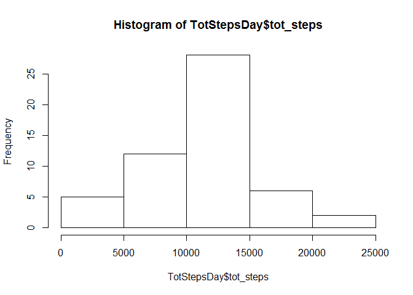
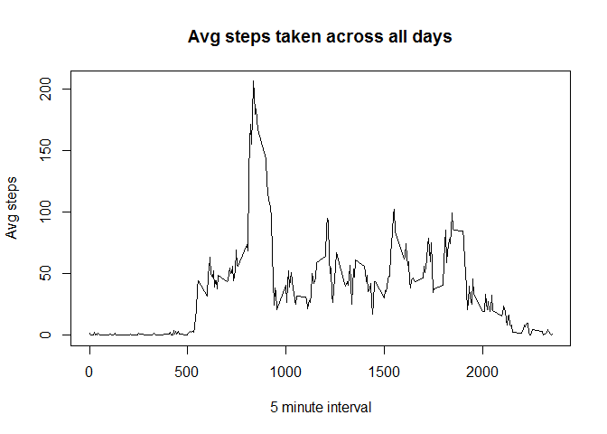
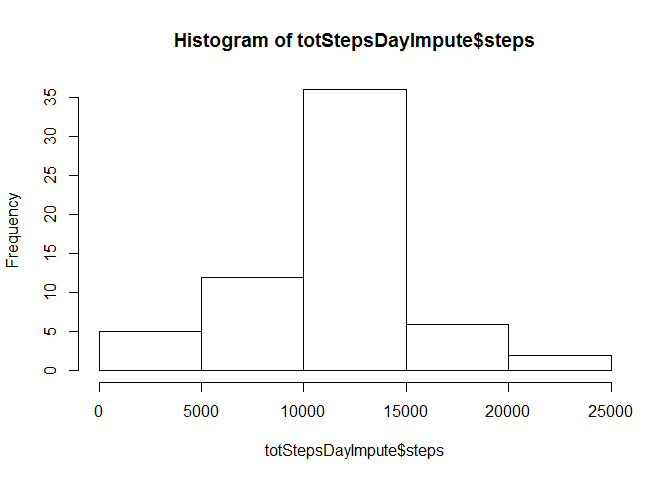
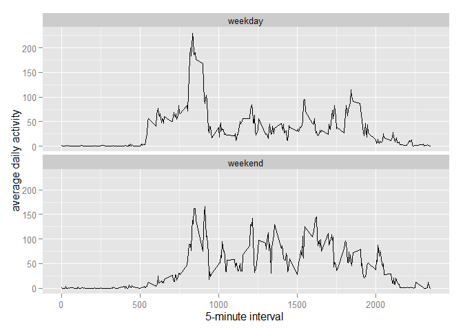

# Reproducible Research: Peer Assessment 1


## Loading and preprocessing the data

```r
setwd("C:/Users/S.Vijayakumar/datasciencecoursera/RepData_PeerAssessment1")
if(!file.exists('activity.csv')){
    unzip('activity.zip')
}
activity = read.csv("activity.csv")
summary(activity)
```

```
##      steps                date          interval     
##  Min.   :  0.00   2012-10-01:  288   Min.   :   0.0  
##  1st Qu.:  0.00   2012-10-02:  288   1st Qu.: 588.8  
##  Median :  0.00   2012-10-03:  288   Median :1177.5  
##  Mean   : 37.38   2012-10-04:  288   Mean   :1177.5  
##  3rd Qu.: 12.00   2012-10-05:  288   3rd Qu.:1766.2  
##  Max.   :806.00   2012-10-06:  288   Max.   :2355.0  
##  NA's   :2304     (Other)   :15840
```

```r
# Convert date and interval to proper format
activity$date = as.Date(activity$date, format = "%Y-%m-%d")
#activity$interval = as.factor(activity$interval)
str(activity)
```

```
## 'data.frame':	17568 obs. of  3 variables:
##  $ steps   : int  NA NA NA NA NA NA NA NA NA NA ...
##  $ date    : Date, format: "2012-10-01" "2012-10-01" ...
##  $ interval: int  0 5 10 15 20 25 30 35 40 45 ...
```


## What is mean total number of steps taken per day?

```r
# Calculating the total number of steps taken per day
TotStepsDay = setNames(aggregate(activity$steps~date,data=activity,sum), 
                       c("date", "tot_steps"))
#Creating a histogram of the total number of steps taken each day.
hist(TotStepsDay$tot_steps)
```

 

The mean and the median are as follows:

```r
mean(TotStepsDay$tot_steps)
```

```
## [1] 10766.19
```

```r
median(TotStepsDay$tot_steps)
```

```
## [1] 10765
```


## What is the average daily activity pattern?

```r
TotStepsinterval = tapply(activity$steps, activity$interval, mean, na.rm = TRUE)

# Time series plot
plot(row.names(TotStepsinterval), TotStepsinterval, type = "l", xlab = "5 minute interval", ylab = "Avg steps", main = "Avg steps taken across all days")
```

 

The the 5-minute interval that contains the max number of steps is: 

```r
max_interval = which.max(TotStepsinterval)
names(max_interval)
```

```
## [1] "835"
```


## Imputing missing values


```r
na = sum(is.na(activity))
```

The total number of missing values in this data set are 2304


```r
library(plyr)
impute.mean = function(x) replace(x,is.na(x), mean(x, na.rm = TRUE))
```


```r
#imputing for missing values
activityNaImpute = ddply(activity, ~ interval, transform, steps = impute.mean
                         (steps))
```


```r
totStepsDayImpute = setNames(aggregate(activityNaImpute$steps~date,data=
                                    activityNaImpute,sum), c("date","steps"))
hist(totStepsDayImpute$steps)
```

 

```r
mean(totStepsDayImpute$steps)
```

```
## [1] 10766.19
```

```r
median(totStepsDayImpute$steps)
```

```
## [1] 10766.19
```

After imputing missing values the median number of steps varies slightly from the initial result.  The mean stays the same. 


## Are there differences in activity patterns between weekdays and weekends?


```r
# Creating a new weekend factor
Wkend = c("Saturday", "Sunday")
activityNaImpute$wkday = factor((weekdays(activityNaImpute$date) %in% Wkend), 
                levels = c(FALSE, TRUE), labels = c('weekday', 'weekend')) 
```


 


```r
library(dplyr)
```

```
## 
## Attaching package: 'dplyr'
## 
## The following objects are masked from 'package:plyr':
## 
##     arrange, count, desc, failwith, id, mutate, rename, summarise,
##     summarize
## 
## The following objects are masked from 'package:stats':
## 
##     filter, lag
## 
## The following objects are masked from 'package:base':
## 
##     intersect, setdiff, setequal, union
```

```r
library(ggplot2)
avgwkday = setNames(activityNaImpute %>% group_by(wkday, interval) %>% 
    summarise(mean(steps)), c("wkday", "interval", "steps"))

#Panel plot of the average number of steps taken weekend vs week day
ggplot(avgwkday, aes(interval, steps), group = wkday) + geom_line() +
    xlab("5-minute interval ") + ylab("average daily activity") + 
    facet_wrap( ~ wkday, nrow = 2, ncol = 1)
```

 

The two time series show that overall the weekend shows more average activity between the 1000th and 2000th interval compared to the weekday.  
